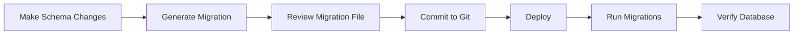

# Database Migration Guide - Uniclima Vendure

This document describes how to manage database migrations and data seeding for the Uniclima Vendure e-commerce platform.

## Table of Contents

1. [Prerequisites](#prerequisites)
2. [Database Configuration](#database-configuration)
3. [Migration Workflow](#migration-workflow)
4. [Running Migrations](#running-migrations)
5. [Generating New Migrations](#generating-new-migrations)
6. [Database Verification](#database-verification)
7. [Initial Seeding](#initial-seeding)
8. [WooCommerce Data Import](#woocommerce-data-import)
9. [Troubleshooting](#troubleshooting)

---

## Prerequisites

- Docker and Docker Compose installed
- Node.js 18.17+ or 20.3+ or 21.0+
- npm or yarn package manager

## Database Configuration

### Environment Variables

The database connection is configured through environment variables. Copy `.env.example` to `.env` and adjust:

```bash
# Database Configuration
DB_HOST=db              # 'db' for Docker, 'localhost' for local PostgreSQL
DB_PORT=5432            # Default PostgreSQL port
DB_NAME=vendure         # Database name
DB_USERNAME=vendure     # Database user
DB_PASSWORD=vendure     # Database password (CHANGE IN PRODUCTION!)
```

### Development vs Production

| Setting | Development | Production |
|---------|-------------|------------|
| `synchronize` | `true` (auto-sync schema) | `false` (use migrations) |
| `DB_HOST` | `db` (Docker) | External managed DB |
| `DB_PASSWORD` | Simple | Strong (16+ chars) |

The `synchronize` setting is automatically determined by `APP_ENV`:
- `APP_ENV=dev` → `synchronize: true`
- `APP_ENV=production` → `synchronize: false`

---

## Migration Workflow



### Important Notes

1. **Never** set `synchronize: true` in production
2. **Always** review generated migrations before committing
3. **Always** backup your database before running migrations in production
4. Migrations run automatically on server start via `runMigrations()`

---

## Running Migrations

### Automatic (On Server Start)

Migrations run automatically when the server starts:

```typescript
// src/index.ts
runMigrations(config)
    .then(() => bootstrap(config))
```

### Manual (Standalone)

Run migrations without starting the full server:

```bash
# From backend directory
cd backend
npm run migrations:run
```

### Via Docker Compose

```bash
docker-compose exec backend npm run migrations:run
```

---

## Generating New Migrations

When you make changes to:
- Custom fields
- Plugin entities
- Any database schema changes

Generate a new migration:

```bash
# From backend directory
cd backend
npm run migrations:generate
```

This uses the Vendure CLI to generate a timestamped migration file in `src/migrations/`.

### Example Migration File

```typescript
// src/migrations/1701234567890-AddCustomFields.ts
import { MigrationInterface, QueryRunner } from 'typeorm';

export class AddCustomFields1701234567890 implements MigrationInterface {
    public async up(queryRunner: QueryRunner): Promise<void> {
        await queryRunner.query(`ALTER TABLE "product" ADD "customFieldsShortdescription" varchar(255)`);
    }

    public async down(queryRunner: QueryRunner): Promise<void> {
        await queryRunner.query(`ALTER TABLE "product" DROP COLUMN "customFieldsShortdescription"`);
    }
}
```

---

## Database Verification

### Check Database Connection

```bash
# Using npm script (from backend)
cd backend
npm run db:check

# Using shell script (from root)
./scripts/check-db.sh
```

### Expected Output

```
🔍 Checking database connection...
   Host: db
   Port: 5432
   Database: vendure
   User: vendure

✅ Successfully connected to PostgreSQL!
📊 PostgreSQL Version: PostgreSQL 13.x
📋 Tables in database: 45
✅ Database connection check completed successfully!
```

---

## Initial Seeding

After running migrations on a fresh database, seed initial data:

```bash
cd backend
npm run seed
```

This creates:
- Superadmin user (from environment variables)
- Default channel
- Base product categories (from WooCommerce data)
- Brand facets (Saunier Duval, Junkers, Ferroli, etc.)

---

## WooCommerce Data Import

Import existing products from WooCommerce CSV export:

```bash
cd backend
npm run import:woocommerce
```

### CSV File Location

The WooCommerce export file should be placed at the project root:
```
wc-product-export-*.csv
```

### Mapped Fields

| WooCommerce | Vendure |
|-------------|---------|
| SKU | ProductVariant.sku |
| Nombre | Product.name |
| Descripción | Product.description |
| Descripción corta | Product.customFields.shortDescription |
| Precio normal | ProductVariant.price |
| Categorías | Collection assignment |
| Etiquetas (Brands) | Facet/FacetValue |
| Inventario | ProductVariant.stockOnHand |

---

## Troubleshooting

### Connection Refused

```
Error: ECONNREFUSED
```

**Solutions:**
1. Ensure PostgreSQL container is running: `docker-compose up -d db`
2. Check `DB_HOST` in `.env` (should be `db` for Docker)
3. Wait a few seconds for the database to initialize

### Database Does Not Exist

```
Error: 3D000 - database "vendure" does not exist
```

**Solution:**
Create the database manually:
```bash
docker-compose exec db psql -U postgres -c "CREATE DATABASE vendure;"
```

### Authentication Failed

```
Error: 28P01 - authentication failed
```

**Solutions:**
1. Verify `DB_USERNAME` and `DB_PASSWORD` in `.env`
2. Check that the user exists in PostgreSQL
3. Ensure the database was created with the correct owner

### Migration Failed

**Solutions:**
1. Check migration file syntax
2. Review database logs: `docker-compose logs db`
3. Revert last migration if needed: `npm run migrations:revert`
4. Fix the migration and try again

### Tables Exist But No Data

This usually means migrations ran but seeding was not performed:
```bash
npm run seed
```

---

## Quick Reference

| Command | Description |
|---------|-------------|
| `npm run dev` | Start development server |
| `npm run migrations:generate` | Generate new migration |
| `npm run migrations:run` | Run pending migrations |
| `npm run db:check` | Verify database connection |
| `npm run seed` | Seed initial data |
| `npm run import:woocommerce` | Import WooCommerce products |
| `./scripts/check-db.sh` | Full database health check |

---

## Production Deployment Checklist

- [ ] Set `APP_ENV=production`
- [ ] Use strong `DB_PASSWORD` (16+ characters)
- [ ] Configure external PostgreSQL host
- [ ] Generate new `COOKIE_SECRET`
- [ ] Change superadmin credentials
- [ ] Backup database before migrations
- [ ] Run migrations: `npm run migrations:run`
- [ ] Verify migration success: `npm run db:check`

---

*Last updated: December 2024*